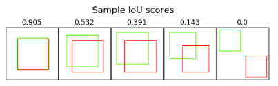
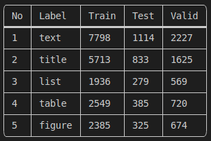

# machine-learning-utils

----
While working on Machine Learning Projects, the developer used many of the same utilities on various projects throughout
time, such as Data Operation, Image Operation, and File Operation. MLUtils library offers such a utility to developers
for effective machine learning project development.

## Installation Instructions

```
pip install git+https://github.com/gitgeekhack/ml-utils.git
```

## Getting Started

---

### Data Operation

Data Operation utility provides functionality of Image Augmentation for Model Training.

#### Example

- #### Augmentation

  This utility is designed to augment dataset of Object Detection (For now only Yolo annotation format supported). To
  augment the dataset using this utility following parameters are required:

> 1. Source Path, where your Dataset is located
> 2. Target Path, where Augmented Dataset you would like to save
> 3. Multiplier, How many times an image should be augmented
> 4. Transform, It is a class object of albumentations library which contains augmentation techniques and their
     configuration

### Image Operation

Image Operation module provide functionality specific to image related operation like Fix skew angle, Calculate IOU,
Match Template, Generate Image Dataset Summary, etc.

#### Example

- #### Get Object

  With this method, the detected object is cropped from the original image. It needs three arguments: an image,
  coordinates, and a label.

    ```python
    import cv2
    from mlutils.image.cv_helper import get_object
    
    image = cv2.imread('image.png')
    coord = [25, 50, 75, 100]
    
    cropped_image = get_object(target_img=image, coordinates=coord, label='Test')
    ```

- #### Calculate IOU

  Intersection over Union (IoU) is a metric that allows us to evaluate how much image2 is overlapped to image1. Please
  refer below image to understand metrics result.

    |  | If the result is closer to 1, it implies that the two images are more overlapped; if it is closer to 0, it means that there is less overlap. |
    |----------------------------------------------------|----------------------------------------------------------------------------------------------------------------------------------------------|

- #### Get Skew Angle

  This method takes a list of YOLO extracted objects and return detected skew angle of the image.

    ```python
    import cv2
    from mlutils.image.cv_helper import get_skew_angel, get_object
    from path.to.yolo.model import model
    
    image = cv2.imread('image.png')
    detected_objects = {}
    results = model(image)
    
    label = {0: 'label_1', 1: 'label_2', 2: 'label_3', 3: 'label_4', 4: 'name'}
    
    for x in results.pred[0]:
        """
        x[-1]  = predicted label 
        x[-2]  = predicted score
        x[:-2] = predicted bbox
        """
        if label[int(x[-1])] not in detected_objects.keys() and label[int(x[-1])]:
            detected_objects[label[int(x[-1])]] = {'score': float(x[-2]), 'bbox': x[:-2].numpy()}
        else:
            max_score = detected_objects[label[int(x[-1])]]['score']
            temp = {'score': float(x[-2]), 'bbox': x[:-2].numpy()}
            if temp['score'] > max_score:
                detected_objects[label[int(x[-1])]] = temp
    
    extracted_objects = [get_object(image, coordinates=detected_object['bbox'], label=label) for
                        label, detected_object in detected_objects.items()]
    
    skew_angle = get_skew_angel(extracted_objects)
    ```


- #### Fix Skew Angle

  This method takes a numpy array of image and angle and return corrected skew angle numpy array of image.

    ```python
    import cv2
    from mlutils.image.cv_helper import fix_skew
    
    image = cv2.imread('image.png')
    angle = 5
    
    fixed_image = fix_skew(image=image, angle=angle)
    ```

- #### Apply bounding box padding
    This method applies padding to the input bounding box relative to the page size
  ```python
  import fitz
  from mlutils.image.cv_helper import apply_bbox_padding

  doc = fitz.open("path/to/pdf_file")
  page_dime = doc[0].CropBox
  x0, y0, x1, y1 = (0.01, 0.01, 0.01, 0.01)
  x = apply_bbox_padding(page_dim=page_dime, input_bbox=(0.25, 0.5, 0.5, 0.75), x0_pad=x0, y0_pad=y0, x1_pad=x1, y1_pad=y1)
  ```
  

- #### Template Match

  Template Matching is a method for searching and finding a template image in a source image; if the template image is
  found in the source image, it returns true; otherwise, it returns false.

    ```python
    import cv2
    from mlutils.image.cv_helper import match_template
    
    source_image = cv2.imread('image.png')
    template_image = cv2.imread('template.png')
    
    is_matched = match_template(template=template_image, image=source_image)
    ```

- #### YoloV5 Algorithm Utility

    - #### Get BBOX by Label

      This method transforms results returned by YoloV5 detect method to a more useful and user-friendly format. It
      takes YoloV5 result as input argument and return list which contains Name, Label, Confidence Score & Bounding Box.
        ```python
        import cv2
        from mlutils.image.yolov5 import get_bbox_by_label
        from path.to.yolo.model import model
    
        image = cv2.imread('image.png')
        results = model(image)
      
        x = get_bbox_by_label(results)
        ```
    - #### Read label classes
      This method gives a list of labels from class.txt file for a YOLO model.
      ```python
      from mlutils.image.yolov5 import read_label_classes
      
      classes = read_label_classes("path/to/class.txt")
      ```
    - #### Split Dataset by labels
      This method splits image dataset by class labels
      ```python
       from mlutils.image.yolov5 import split_dataset_by_labels
       x = split_dataset_by_labels(image_path='data/yolov5_dataset/train/images',
                                    annotation_path='data/yolov5_dataset/train/labels/',
                                    class_labels=['class1', 'class2', 'class3', 'class4'], target_path=None, save=False)
      ```
    - #### Dataset Summary

      This method generate a comprehensive summary such as the volume of a certain label in the dataset using the
      data.yaml file. To get understanding of data.yaml file format please refer to
      this [link](https://github.com/ultralytics/yolov5/blob/master/data/coco128.yaml). By default, the save parameter
      is set to _False_; to save the summary as a CSV file, set it to _True_.

      ```python
      from mlutils.image.yolov5 import dataset_summary
    
      dataset_summary(data_file='./data.yaml', save=True)
      ```

       #### Sample Output
    
      

### Digital File Operation
Digital pdf helper modules provides functionalities to find pages by text, get images from a particular page, etc.
  - #### Get images by page
    This method extracts all images from input page of a digital pdf document.
    ```python
    from mlutils.pdf.digital_pdf_helper import PDFHelper
    
    pdf = PDFHelper("path/to/pdf_file")
    images_for_page_1 = pdf.get_images_by_page(1)
    ```
  - #### Find page by text
      This method finds page number where input text is found.
      ```python
      from mlutils.pdf.digital_pdf_helper import PDFHelper
    
      pdf = PDFHelper("path/to/pdf_file")
      page_no = pdf.find_page_by_text("Sample Text")
      ```
  - #### Get bounding box by text
      This method finds page number where input text is found.
      ```python
      from mlutils.pdf.digital_pdf_helper import PDFHelper
    
      pdf = PDFHelper("path/to/pdf_file")
      bbox = pdf.get_bbox_by_text("Sample Text")
      ```
  - #### Get attributes by page
      This method Returns all attributes of input page of document.
      ```python
      from mlutils.pdf.digital_pdf_helper import PDFHelper
    
      pdf = PDFHelper("path/to/pdf_file")
      attributes = pdf.get_attributes_by_page(2)
      ```

  - #### Get Form fields by page
      This method returns PDF Form field, also called a “widget”, as dictionary of field name as key and field value as dictionary value and returns None when no form field is found on the page.
      ```python
      from mlutils.pdf.digital_pdf_helper import PDFHelper
    
      pdf = PDFHelper("path/to/pdf_file")
      form_fields = pdf.get_form_fields_by_page(3)
      ```